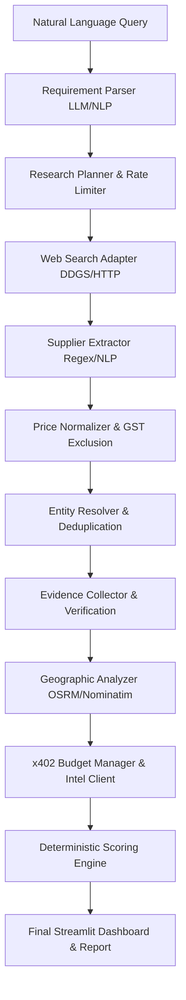

# ProcureX — Autonomous B2B Procurement Research Agent

ProcureX is an autonomous procurement research agent tailored for Indian B2B procurement markets. It accepts natural-language procurement queries (e.g. industrial nitrile safety gloves under ₹80/piece), parses structured constraints, plans multi-source discovery, extracts and normalizes supplier pricing, deduplicates business entities, verifies government/registry claims, calculates route delivery transit feasibility, autonomously manages research budgets via the **x402 micro-payment protocol**, and computes deterministic 6-dimension capability scores.

---

## 🌟 Key Features

- **📝 Natural Language Requirement Parsing**: Hybrid Google Gemini LLM + regex NLP fallback for Indian B2B procurement queries (quantity, unit budget, material, destination, deadline, and supplier type preferences).
- **🌐 Autonomous Discovery & Rate-Limited Acquisition**: Pluggable `ResearchSource` interface with DuckDuckGo search integration and per-domain rate limiting (minimum 2.0s delay per domain).
- **🧹 Price Normalization & Entity Deduplication**:
  - Converts box, pair, carton, and bulk pricing to normalized unit INR (GST-exclusive, HSN 4015 18% tax adjustment).
  - Entity resolver merges duplicate suppliers via GSTIN, phone normalization, website domain, and name similarity (avoiding false-positive merges across different cities).
- **🔗 Evidence Graph & Contradiction Detection**:
  - Multi-claim evidence graph tracking provenance (`CLAIMED`, `DOCUMENTED`, `CORROBORATED`, `VERIFIED`, `CONFLICTING`).
  - Automated contradiction detector flagging price discrepancies >10% or identity attribute mismatches.
- **📍 Geographic & Route Feasibility**: OpenStreetMap Nominatim geocoding + OSRM driving route estimation for delivery deadline assessment.
- **💰 Autonomous Budget Manager & x402 Protocol**:
  - Information value vs cost decision-making before purchasing paid intelligence.
  - Autonomous HTTP 402 Payment Required protocol integration for micro-payments ($0.002 Price Intelligence, $0.001 Supplier Verification).
- **📊 6-Dimension Deterministic Scoring**:
  - Multi-dimensional capability scoring across *Product Fit*, *Price Competitiveness*, *Business Verification*, *Delivery Feasibility*, *MOQ Compatibility*, and *Evidence Quality*.
  - Procurement mode presets (`BALANCED`, `COST_OPTIMIZED`, `RELIABILITY_FIRST`).
- **💻 Premium Streamlit Dashboard**: Dark glassmorphic interface (`#0a0e27`) featuring 6 interactive pages.

---

## 🏗️ Architecture & Pipeline Flow



---

## 📂 Repository Structure

```
procurex/
├── app.py                      # Main Streamlit Dashboard entrypoint
├── pages/                      # Multi-page Streamlit routes (auto-discovered)
│   ├── 1_research.py           # Requirement input & canonical query pre-fill
│   ├── 2_live_research.py      # Real-time agent execution log & metrics
│   ├── 3_suppliers.py          # Ranked supplier cards & radar charts
│   ├── 4_evidence.py           # Evidence browser & contradiction detector
│   ├── 5_economic_trace.py     # x402 budget decisions & payment log
│   └── 6_final_report.py       # Executive report & Markdown download
├── extraction/                 # NLP parsing & supplier extraction
│   ├── requirement_parser.py   # LLM/rule-based requirement parser
│   ├── supplier_extractor.py  # Regex/LLM HTML entity extractor
│   └── provenance.py          # Evidence record provenance helpers
├── acquisition/                # Data collection & web search
│   ├── base.py                 # ResearchSource abstract interface
│   ├── web_search.py           # DuckDuckGo search adapter
│   └── rate_limiter.py         # Per-domain rate limiter
├── processing/                 # Data processing & scoring
│   ├── price_normalizer.py     # Unit price & GST normalization
│   ├── product_matcher.py      # Material/application/size matching
│   ├── entity_resolver.py      # Supplier entity deduplication
│   ├── moq_validator.py        # Minimum order quantity validation
│   ├── geographic.py           # Geocoding & route feasibility
│   └── scoring.py              # 6-dimension scoring engine
├── verification/               # Evidence verification & registries
│   ├── evidence_graph.py       # Evidence graph & contradiction engine
│   ├── gst_verifier.py         # GSTIN verification handler
│   ├── udyam_verifier.py       # Udyam MSME verification handler
│   └── evidence_collector.py   # Verification orchestrator
├── agent/                      # Orchestration & budget planning
│   ├── orchestrator.py         # Main research pipeline runner
│   ├── planner.py              # Query generation planner
│   └── budget_manager.py       # x402 buy/skip decision engine
├── x402/                       # x402 micro-payment client & mocks
│   ├── client.py               # x402 HTTP client
│   └── mock.py                 # x402 mock payment provider
├── models/                     # Pydantic data models
│   ├── requirement.py          # ProcurementRequirement model
│   ├── supplier.py             # Supplier & Product models
│   ├── evidence.py             # EvidenceGraph & Contradiction models
│   ├── scoring.py              # SupplierScore models
│   ├── budget.py               # Budget & Payment models
│   └── geographic.py           # Route & Geocoding models
├── storage/                    # Session management
│   └── session.py              # ResearchSession state store
├── tests/                      # Unit & End-to-End Test Suite
│   ├── test_e2e.py             # Complete Spec §28 end-to-end test
│   ├── test_requirement_parser.py
│   ├── test_price_normalizer.py
│   ├── test_product_matcher.py
│   ├── test_entity_resolver.py
│   ├── test_scoring.py
│   ├── test_evidence.py
│   ├── test_budget_decisions.py
│   └── test_x402.py
├── requirements.txt            # Python dependencies
└── README.md                   # Documentation
```

---

## ⚡ Quickstart Guide

### Prerequisites
- Python 3.10+
- (Optional) `GOOGLE_API_KEY` for Google Gemini LLM parsing

### 1. Installation

Clone the repository and install dependencies:

```bash
git clone https://github.com/ZigzagDeck/procureX.git
cd procureX
pip install -r requirements.txt
```

### 2. Environment Setup (Optional)

Create a `.env` file for Gemini API integration:

```env
GOOGLE_API_KEY="your-google-gemini-api-key"
PROCUREX_X402_MODE="mock"
```

### 3. Run the Application

Launch the Streamlit dashboard:

```bash
streamlit run app.py
```

Open [http://localhost:8501](http://localhost:8501) in your browser.

---

## 🧪 Running Tests

Run the complete 41-test suite:

```bash
python -m pytest tests/ -v
```

Output:
```text
======================= 41 passed in 0.75s =======================
```

---

## 🛡️ License

This project is licensed under the MIT License — see the LICENSE file for details.
