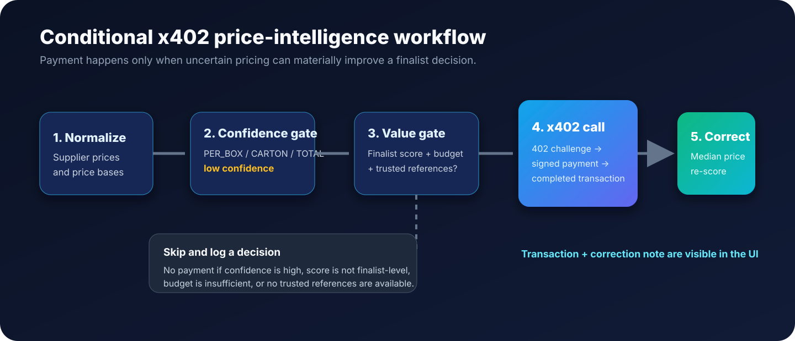

<p align="center"></p>

<p align="center"><strong>Autonomous supplier research with explainable ranking and conditional x402 price intelligence.</strong></p>

<p align="center"><a href="#quick-start">Quick start</a> · <a href="#how-it-works">How it works</a> · <a href="#x402-price-intelligence">x402</a> · <a href="#repository-map">Repository map</a> · <a href="#testing">Testing</a></p>

---

## What is ProcureX?

ProcureX turns a procurement brief—such as “5,000 nitrile gloves under ₹80, deliverable to Ghaziabad”—into a structured research session. It searches for suppliers, extracts product offers, normalizes prices, gathers evidence, assesses delivery, and produces a ranked shortlist.

Every stage is auditable: the session holds phase-aware logs, dimension-level supplier scores, payment decisions, and x402 transactions.

> **MVP scope:** the default x402 mode is offline/mock. It demonstrates a real pipeline decision and HTTP 402 settlement sequence without requiring an external price API or production payment rail.

## Highlights

- Parse free-form procurement requirements into typed fields.
- Search live web sources when available, with deterministic fallback suppliers for offline demos.
- Extract suppliers and quotes, deduplicate records, and preserve source URLs.
- Normalize price, tax, and MOQ data before scoring.
- Rank candidates by product fit, price competitiveness, verification, delivery, MOQ, and evidence quality.
- Inspect supplier cards, evidence, live research progress, and the economic audit trail in Streamlit.
- Pay for price intelligence only when a low-confidence finalist price can be corrected from trusted in-session references.

## How it works

```text
Requirement → Search → Extract → Normalize → Deduplicate → Verify → Delivery analysis → Score → Rank
                                                        └→ Conditional x402 price intelligence → Re-score
```

1. **Plan and search.** `ResearchPlanner` generates targeted queries and `WebSearchSource` retrieves results.
2. **Extract and normalize.** Candidate suppliers and products are extracted, then prices are normalized to INR per piece where possible.
3. **Establish trust.** Entity resolution merges duplicates; evidence collection and geographic analysis enrich candidates.
4. **Score and rank.** `ScoringEngine` calculates six weighted dimensions and sorts the suppliers.
5. **Resolve expensive uncertainty.** A finalist with an unreliable pack/total price can trigger the x402 flow below, then be re-scored.

## x402 price intelligence

<p align="center"></p>

### Why x402 is a genuine pipeline decision

- **Confidence is measured during normalization.** `PER_BOX`, `PER_CARTON`, and `TOTAL` prices are low confidence (`0.25`) because a pack/total denominator may be missing. Other bases are high confidence (`0.9`).
- **A payment must earn its place.** `BudgetManager.should_purchase_price_intel()` approves only when the candidate is finalist-level (score ≥ 50), the price is uncertain, budget is available, and trusted reference prices exist for the category.
- **The async client is actually called.** `X402Client.call_service()` performs the mock HTTP 402 challenge → signed proof → result sequence by default, or calls the configured live service when `PROCUREX_X402_MODE=live`.
- **Every decision is visible.** Approved and skipped decisions go to `session.budget.decisions`; completed/failed payments go to `session.budget.transactions`; both render in the economic trace UI.
- **The result changes ranking.** ProcureX computes the median of high-confidence prices found in the same session. If the risky price differs by more than 2×, it is corrected, annotated on the product, and the supplier is re-scored before final ranking.
- **No reference data means no payment.** The system records a skipped decision instead of spending budget on a correction it cannot make.

### Example: a `PER_BOX` correction

| Stage | Supplier quote | Result |
| --- | --- | --- |
| Extracted | ₹240 `PER_BOX`, pack quantity unknown | Quote becomes low confidence. |
| References | ₹60 and ₹70 per piece from trusted suppliers | Median market reference: ₹65/piece. |
| x402-approved | Finalist score, budget, and references available | Decision and transaction are recorded. |
| Re-ranked | ₹240 → ₹65 per piece | Correction note is shown; price score and final rank update. |

### x402 configuration

Copy `.env.example` to `.env` and configure the values needed for your environment.

```dotenv
# Default deterministic/offline x402 behavior.
PROCUREX_X402_MODE=mock
PROCUREX_PRICE_INTEL_COST=0.002
PROCUREX_INTEL_SERVICE_URL=http://localhost:8000

# Required only for live mode / signing integrations.
X402_SIGNING_SECRET=replace-me
```

`mock` mode is recommended for demos. Live mode expects a compatible service endpoint and is not a substitute for production payment-rail, key-management, or compliance work.

## Quick start

### Prerequisites

- Python 3.10 or newer
- `pip`
- Optional: a Google API key for Gemini-assisted requirement parsing

### Install

```bash
git clone <your-repository-url>
cd procureX
python -m venv .venv
```

Activate the environment:

```bash
# Windows PowerShell
.\.venv\Scripts\Activate.ps1

# macOS / Linux
source .venv/bin/activate
```

Install dependencies and create local configuration:

```bash
pip install -r requirements.txt
copy .env.example .env       # Windows
# cp .env.example .env       # macOS / Linux
```

### Run the app

```bash
python -m streamlit run app.py
```

Open the local address Streamlit prints (normally `http://localhost:8501`). Start at **Requirement Input**, run a research session, then review **Discovered Suppliers** and **Economic Trace**.

## Testing

```bash
python -m pytest -q
```

`tests/test_x402_conditional_pipeline.py` specifically checks that:

- A high-scoring `PER_BOX` quote triggers exactly one transaction, applies a median correction, and increases the supplier score.
- A session with only high-confidence quotes produces no transaction.

## Repository map

This tree is synchronized with the repository’s current source folders. Virtual environments, cache folders, and Python bytecode are omitted.

```text
procureX/
├── app.py                         # Streamlit entry point and shared styling/navigation
├── .env.example                   # Environment-variable template
├── requirements.txt               # Runtime and test dependencies
├── assets/
│   ├── procurex-logo.svg          # README / project brand mark
│   └── x402-workflow.svg          # Conditional payment workflow image
├── acquisition/                   # Search-source adapter, base types, rate limiting
│   ├── base.py
│   ├── rate_limiter.py
│   └── web_search.py
├── agent/                         # Research planning, orchestration, budget decisions
│   ├── budget_manager.py
│   ├── orchestrator.py
│   └── planner.py
├── docs/                          # Product, architecture, data policy, and x402 notes
│   ├── architecture.md
│   ├── data_policy.md
│   ├── domain_rules.md
│   ├── product_spec.md
│   └── x402_spec.md
├── extraction/                    # Requirement parsing, supplier extraction, provenance
│   ├── provenance.py
│   ├── requirement_parser.py
│   └── supplier_extractor.py
├── intelligence/                  # Offline market-price and supplier intelligence helpers
│   ├── price_intelligence.py
│   └── supplier_verification.py
├── models/                        # Pydantic domain models
│   ├── budget.py
│   ├── evidence.py
│   ├── geographic.py
│   ├── requirement.py
│   ├── scoring.py
│   └── supplier.py
├── pages/                         # Primary Streamlit multipage flow
│   ├── 1_Requirement_Input.py
│   ├── 2_Live_Screening_Status.py
│   ├── 3_Discovered_Suppliers.py
│   ├── 4_Evidence_Browser.py
│   └── 5_economic_trace.py
├── processing/                    # Normalization, matching, geography, and scoring
│   ├── entity_resolver.py
│   ├── geographic.py
│   ├── moq_validator.py
│   ├── price_normalizer.py
│   ├── product_matcher.py
│   └── scoring.py
├── services/                      # Optional local price/verification service endpoints
│   ├── price_endpoint.py
│   ├── server.py
│   └── verify_endpoint.py
├── storage/                       # Research session and trace models
│   ├── session.py
│   └── trace.py
├── tests/                         # Unit, E2E, and conditional x402 tests
│   ├── test_x402.py
│   └── test_x402_conditional_pipeline.py
├── ui/                            # Reusable components plus alternate UI pages
│   ├── components/
│   │   ├── budget_tracker.py
│   │   ├── evidence_viewer.py
│   │   ├── requirement_card.py
│   │   └── supplier_card.py
│   └── pages/
│       ├── 1_research.py
│       ├── 2_live_research.py
│       ├── 3_suppliers.py
│       ├── 4_evidence.py
│       ├── 5_economic_trace.py
│       └── 6_final_report.py
├── verification/                  # GST/Udyam verification and evidence graph logic
│   ├── evidence_collector.py
│   ├── evidence_graph.py
│   ├── gst_verifier.py
│   └── udyam_verifier.py
└── x402/                          # Payment client, budget/account, FX, signing, mock helpers
    ├── account.py
    ├── budget.py
    ├── client.py
    ├── fx_engine.py
    ├── mock.py
    └── token_signer.py
```

## Architecture notes

- `ResearchOrchestrator.run_research()` is the main asynchronous pipeline entry point.
- `ResearchSession` holds suppliers, scores, logs, payment decisions, and transactions for one research run.
- `Product` holds raw price, price basis, normalized unit price, confidence, and optional correction note.
- The normalizer intentionally does **not** infer missing box/carton/total denominators. That uncertainty is the signal that can justify price intelligence.

For implementation details, see [architecture](docs/architecture.md), [data policy](docs/data_policy.md), and the [x402 specification](docs/x402_spec.md).

## Demo checklist

1. Use the default `PROCUREX_X402_MODE=mock` configuration.
2. Submit a supplier research request with a price limit.
3. If live search is limited, the fallback adds three candidates, including an intentionally uncertain `PER_BOX` quote.
4. Open **Economic Trace** to show the approved x402 decision and completed transaction.
5. Open **Discovered Suppliers** to show the `₹before → ₹after` correction note and updated rank.

## License

Created as an APEX Creation. No open-source license has been declared for this repository.
