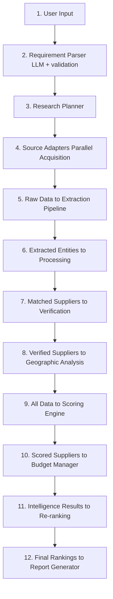

# ProcureX — Architecture

## System Overview
Autonomous procurement research agent that discovers real suppliers, extracts/normalizes data, verifies business evidence, performs geographic analysis, makes autonomous payment decisions via x402, and produces evidence-backed procurement reports.

## Technology Stack
- **Language:** Python 3.11+
- **Frontend:** Streamlit
- **LLM:** OpenAI/Gemini (configurable) for NL parsing and extraction
- **Payment Protocol:** x402 (HTTP 402)
- **Geocoding:** Pluggable (Nominatim/Google Maps)
- **Routing:** Pluggable (OSRM/Google Directions)

## Module Structure

### `ui/`
Streamlit pages (6 pages): Research Input, Live Research, Suppliers, Evidence, Economic Trace, Final Report. No business logic here — delegates to agent/services.

### `agent/`
Core orchestrator. Implements the research pipeline: parse requirement → plan research → discover suppliers → extract data → normalize → deduplicate → match → verify → geo-analyze → score → decide on paid intelligence → re-rank → report. Uses `ResearchSource` abstraction.

### `acquisition/`
Data acquisition layer. Defines `ResearchSource` interface with `search()`, `fetch()`, `extract()`. Source adapters (e.g., web search, marketplace) implement this interface independently. Includes rate limiting, robots.txt respect, retry logic.

### `extraction/`
LLM-powered and rule-based extraction of supplier and product data from raw acquired content. Every extracted field preserves provenance (source, URL, timestamp, confidence).

### `processing/`
Price normalization (per-piece, per-pair, GST handling), MOQ validation, product matching (material, application, size), entity resolution/deduplication (name, GSTIN, phone, website, address similarity).

### `verification/`
Evidence collection from government/public sources (GST lookup, Udyam/MSME). Manages evidence status lifecycle: `CLAIMED` → `DOCUMENTED` → `CORROBORATED` → `VERIFIED`. Never auto-upgrades status.

### `intelligence/`
Specialized intelligence services: Price Intelligence, Supplier Verification. These are the paid services exposed via FastAPI endpoints, protected by x402 in production.

### `x402/`
Isolated x402 client logic. Handles HTTP 402 challenge-response flow, payment signing, budget tracking. Uses official x402 Python SDK. Wallet secrets via env vars only.

### `services/`
FastAPI service endpoints for paid intelligence (`POST /v1/price-intelligence`, `POST /v1/supplier-verification`). Includes mock mode for development.

### `models/`
Pydantic data models: `ProcurementRequirement`, `Supplier`, `Product`, `EvidenceRecord`, `SupplierScore`, `ResearchBudget`, `PaymentDecision`, `GeographicAnalysis`.

### `storage/`
In-memory and file-based storage for research sessions. Stores raw data, extracted entities, evidence graphs, research traces.

### `tests/`
Pytest-based tests covering all modules per spec section 25.

## Data Flow Diagram

### Detailed Flow Steps
1. **User Input → Requirement Parser:** Natural language input parsed via LLM with schema validation into structured `ProcurementRequirement`.
2. **Requirement → Research Planner:** Formulates multi-angle search query strategies and source selection.
3. **Plan → Source Adapters:** Parallel data collection via pluggable `ResearchSource` implementations.
4. **Raw Data → Extraction Pipeline:** Extracts granular entity properties with explicit provenance tracking.
5. **Extracted Entities → Processing:** Normalizes metrics (pricing, unit conversion, GST), validates MOQs, matches attributes, and resolves duplicates.
6. **Matched Suppliers → Verification:** Cross-checks claims against external/government records (GST, Udyam) managing evidence lifecycle.
7. **Verified Suppliers → Geographic Analysis:** Evaluates supply chain spatial metrics, transport distances, and routing options.
8. **All Data → Scoring Engine:** Multi-factor scoring across price, capability, verification level, and geography.
9. **Scored Suppliers → Budget Manager:** Evaluates autonomous x402 payment decisions for paid intelligence enrichment based on ROI thresholds.
10. **Intelligence Results → Re-ranking:** Re-weights and updates supplier metrics using retrieved paid intelligence.
11. **Final Rankings → Report Generator:** Formats actionable evidence-backed procurement report for UI presentation.

## Key Design Decisions
- `ResearchSource` is the primary abstraction; no source is hard-coded into the agent.
- Evidence graph tracks provenance for every claim.
- Score and Confidence are independent metrics.
- x402 payments are only for intelligence services, never for internal computation.
- Mock mode is clearly separated from production data paths.
- All secrets via environment variables / Streamlit secrets.

## Deployment
- Single command: `streamlit run app.py`
- Intelligence services run as embedded FastAPI endpoints (or separate process)
- Environment variables for all secrets and API keys
